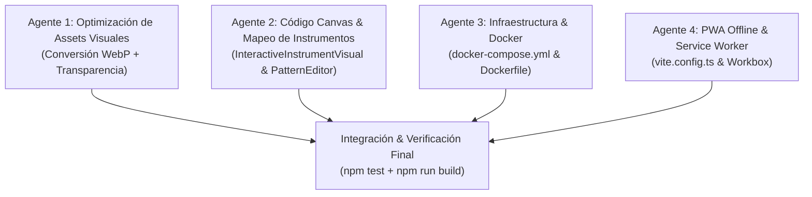

# Plan de Optimización e Integración Paralela (Multi-Agente)

Este plan detalla las optimizaciones de rendimiento visual, procesamiento de imágenes con transparencia, afinación de código/canvas, empaquetado Docker y configuración PWA Offline para el Metrónomo. El trabajo está estructurado en **sub-tareas desacopladas** diseñadas para ejecutarse en paralelo utilizando múltiples agentes de IA.

---

## Estructura de Trabajo Multi-Agente (N Agentes en Paralelo)

---

## Tareas por Agente

### Agente 1: Assets Visuales & Optimización de Imágenes
* **Objetivo:** Convertir de JPG a WebP (reducción de peso de ~14.4MB a ~1.5MB) y generar recortes transparentes para instrumentos.
* **Archivos Afectados:**
  * `public/instruments/*.webp`
  * `public/genres/*.webp`
  * `public/instruments/*.jpg` (eliminar)
  * `public/genres/*.jpg` (eliminar)

### Agente 2: Renderizado Canvas & Mapeo de Componentes React
* **Objetivo:** Actualizar referencias a `.webp`, remover el hack de `globalCompositeOperation = 'screen'` y mapear los nuevos instrumentos en la UI.
* **Archivos Afectados:**
  * `src/components/InteractiveInstrumentVisual.tsx`
  * `src/components/MixerConsole.tsx`
  * `src/components/PatternEditor.tsx`
  * `src/App.tsx`
  * `src/rhythms/RhythmPatterns.ts`

### Agente 3: Infraestructura & Configuración Docker
* **Objetivo:** Ajustar el empaquetado de contenedores para evitar conflictos de volumen local en producción.
* **Archivos Afectados:**
  * `docker-compose.yml`

### Agente 4: PWA, Service Worker & Precaché Offline
* **Objetivo:** Garantizar la disponibilidad offline completa de las imágenes y assets estáticos.
* **Archivos Afectados:**
  * `vite.config.ts`

---

## Plan de Verificación

* `npm test`: Suite de tests unitarios.
* `npm run build`: Validación del compilador TypeScript y bundle de Vite.
