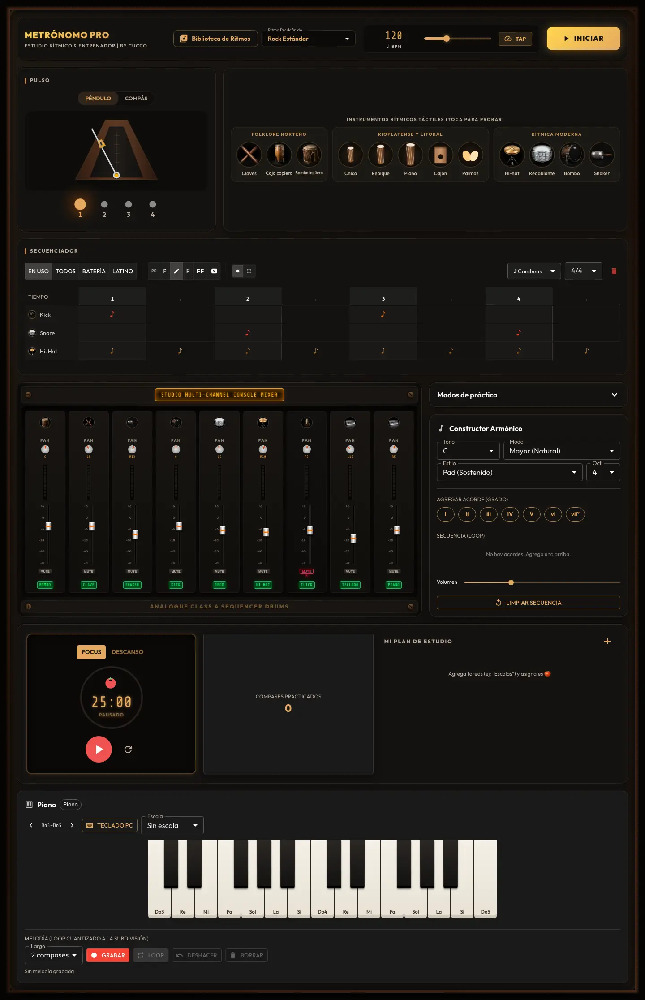
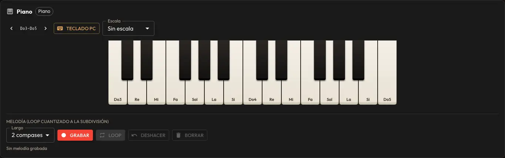
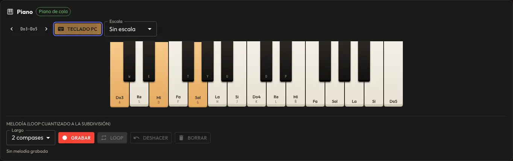
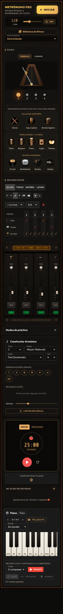
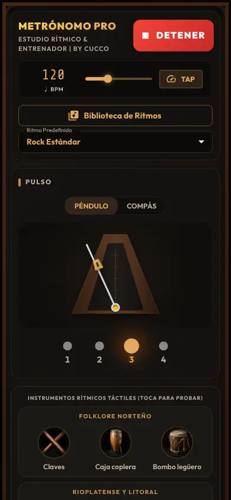
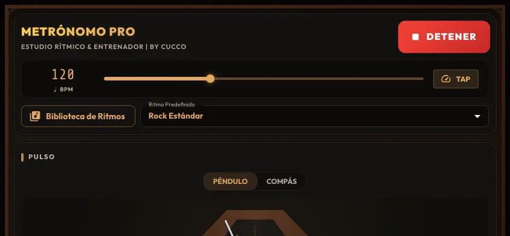

> **Estado:** Pendiente (propuesta). Auditoría hecha sobre `main` en `5dcab7c` (2026-10-04). No hay cambios de código: esto es un plan para leer y decidir.

# Plan de mejoras de UX y teclado — Metrónomo by Cucco

Fecha: 2026-10-04 · Base: `main` (`5dcab7c`) · Objetivos: iPhone (Safari y PWA en pantalla de inicio), Safari macOS 27 y Chrome actual.

**Pedido:** que paneles como el mezclador se puedan ocultar, ideas para mejorar la experiencia visual, que el piano se pueda tocar con el teclado de la PC y qué librerías existen para no reinventar la rueda.

**Respuesta corta:**

1. El piano **ya se toca con el teclado de la PC**: las teclas A W S E D F T G Y H U J K O L P Ñ tocan notas y Z / X cambian de octava. Pero casi nadie lo va a descubrir. Las letras solo aparecen si se activa "Teclado PC", son de 10 px al 70 % de opacidad y no hay ninguna ayuda visible. El trabajo pendiente es de descubribilidad y de completar funciones (velocidad, pedal, conflictos con atajos), no de reescribir el teclado.
2. Hoy la pantalla es una sola columna larga con todos los paneles siempre visibles: 2.232 px de alto en escritorio y 3.785 px en iPhone. El transporte (Iniciar y BPM) desaparece al hacer scroll. La mejora de mayor impacto es un **sistema de vistas**: paneles plegables u ocultables persistidos, presets por actividad y una barra de transporte fija.
3. Librerías: no conviene cambiar el teclado propio por otro. Sí vale adoptar **Tonal.js** (teoría musical) y, más adelante, **cmdk** (paleta de comandos). Para atajos se propone un registro propio pequeño, o `tinykeys` si se quiere una dependencia. El detalle está en la sección [Librerías](#librerías-no-reinventar-la-rueda).

## Resumen ejecutivo: top 5 por impacto / esfuerzo

| # | Propuesta | Impacto | Esfuerzo | Por qué primero |
|---|-----------|---------|----------|-----------------|
| 1 | **Paneles plegables y ocultables + menú "Vista" con presets** (Metrónomo, Ritmos, Armonía/Piano, Estudio, Todo), persistidos | Muy alto | M | Responde el pedido directamente. Hace que la app quepa en una pantalla según la actividad. No necesita librerías: alcanza con MUI `Collapse` y `usePersistentState`, que ya se usan. |
| 2 | **Barra de transporte fija** (sticky) con Play, BPM ± y el pulso del compás; en el teléfono va abajo con botones grandes ("modo bolsillo") | Muy alto | S–M | Hoy el Play y el BPM se pierden apenas se baja a tocar el piano o el secuenciador. |
| 3 | **Descubribilidad del Teclado PC**: letras siempre visibles y legibles, banda que marca el rango mapeado, indicador "Teclado PC activo · Esc para salir" y velocidad con C / V | Alto | S | Es lo que se pidió. La función existe, pero no se ve. |
| 4 | **Hoja de atajos con `?`** generada desde un registro único de atajos, que además resuelve el choque T (tap) ↔ T (Fa♯) | Alto | S–M | Una sola fuente de verdad para atajos, ayuda y tooltips. |
| 5 | **Mezclador compacto**: solo los canales que usa el ritmo, con "Mostrar todos", Solo, tira horizontal en el teléfono y menos decoración | Medio-alto | M | Ocupa 525 px para 9 canales y en el ritmo por defecto se usan 3. |

Después siguen el modo escenario (pantalla completa, wake lock y pulso gigante), Tonal.js, la paleta de comandos (⌘K) y MIDI por USB en Chrome.

---

## Hoy (auditoría)

Capturas tomadas con Playwright (Chromium, `vite preview` del build de producción) en 1440×900, 844×390 y 390×844, en reposo y reproduciendo. Están en [`docs/screenshots/ux-audit/`](../screenshots/ux-audit/), en WebP, 256 KB en total.

### Escritorio 1440×900



- **H1. Todo está visible siempre.** La página mide 2.232 px y en el primer pantallazo solo entran el encabezado, el pulso, los instrumentos y el secuenciador. El piano empieza en y≈1.770, a dos pantallas de distancia. Ningún panel se puede plegar u ocultar, salvo "Modos de práctica", que ya es un `Accordion`.
- **H2. El transporte no es fijo.** `HeaderToolbar` no usa `position: sticky`; no hay ningún `sticky` en `src/`. Al bajar al piano o al mezclador, para detener hay que volver arriba o usar Espacio, y el Espacio no está documentado en ninguna parte de la UI.
- **H3. El panel de instrumentos tiene mucho aire.** En la captura [reproduciendo](../screenshots/ux-audit/desktop-playing-fold.webp), los 13 botones ocupan menos de la mitad del alto de la tarjeta, que se estira para igualar la fila del pulso.
- **H4. El mezclador ocupa mucho para lo que aporta** ([recorte](../screenshots/ux-audit/desktop-mixer.webp)). Muestra siempre los 9 canales (BOMBO, CLAVE, SHAKER, KICK, REDO, HI-HAT, CLICK, TECLADO, PIANO), aunque Rock Estándar use 3. Dedica dos franjas a decoración ("STUDIO MULTI-CHANNEL CONSOLE MIXER" y "ANALOGUE CLASS A SEQUENCER DRUMS", en inglés, con tornillos). Las escalas (+6, 0, −18…) y "PAN" están en ~7–8 px. No hay Solo.
- **H5. Herramientas de estudio** ([recorte](../screenshots/ux-audit/desktop-estudio.webp)): la tarjeta "Compases practicados 0" ocupa un tercio del ancho para un número. El botón rojo grande del Pomodoro parece un segundo "Play" del metrónomo (hay dos botones de reproducir en la página). "FOCUS" está en inglés.
- **H6. Mezcla de idiomas y jerarquía tipográfica:** títulos en inglés ("STUDIO MULTI-CHANNEL…", "FOCUS"), el chip "Piano" repite el título "Piano" mientras las muestras no cargaron, y los títulos de panel son de tres estilos distintos (barrita ámbar "PULSO", tarjeta "Constructor Armónico" con ícono, cartel LED del mezclador).

### Piano y teclado de la computadora

| Teclado PC apagado | Teclado PC encendido (A + D + G apretadas) |
|---|---|
|  |  |

Lo que ya existe (`usePianoComputerKeyboard.ts`, `notes.ts`, `PianoKeyboard.tsx`):

- Mapeo estilo Ableton por **posición física** (`KeyboardEvent.code`): A=Do, W=Do♯, S=Re… K=Do+1, O, L, P, Ñ (`Semicolon`). Funciona igual en un teclado español o en uno US.
- Z / X cambian de octava, con un rango visible "Do3–Do5" y límites Do2–Do6.
- Polifonía con conteo de fuentes (mouse, touch, teclado y Enter sobre la misma nota), liberación en `blur` y en `visibilitychange`.
- El botón "Teclado PC" (persistido) activa el modo global. Apagado, las letras solo suenan con el foco dentro del panel del piano.
- Accesible: cada tecla es un `<button>` con `aria-label` en español ("Do sostenido 4") y `aria-pressed`, con foco itinerante por flechas y Enter para tocar.

Huecos encontrados:

| # | Hueco | Detalle |
|---|-------|---------|
| P1 | **Las letras están escondidas** | `showKeyHints` depende de `settings.computerKeys`. Con el modo apagado, que es el valor por defecto, no hay ninguna pista. La única explicación está en el `title` del botón, un tooltip nativo que no existe en iPhone ni con teclado. |
| P2 | **Letras poco legibles** | `.piano-key__hint` usa 10 px, `opacity: .7` y está pegada al nombre de la nota (ver la captura). En las teclas negras queda gris sobre negro. |
| P3 | **El rango mapeado no se ve** | El teclado muestra 25 teclas (2 octavas) y las letras cubren 17 (Do3–Mi4). Las 8 de arriba no tienen letra y no hay ninguna marca que diga "esto es lo que toca tu teclado". |
| P4 | **Velocidad fija** | `COMPUTER_KEY_VELOCITY = 0.8`. Con el mouse ya hay velocidad por altura (`velocityFromPointer`), pero con el teclado no. |
| P5 | **Sin pedal de sustain** | No hay pedal ni por teclado ni en pantalla. El Espacio está reservado para Play/Stop y conviene mantenerlo así. |
| P6 | **Choque T** | Con "Teclado PC" encendido, T toca Fa♯ y el tap tempo deja de responder al teclado, sin aviso. El comentario del hook lo admite ("los atajos globales se hacen a un lado"), pero la UI no lo explica. |
| P7 | **Estado de foco invisible** | Con el modo apagado, las letras funcionan solo si el foco está en el panel. Nada indica si el foco está ahí o no. |
| P8 | **Teclados no QWERTY** | El sonido es correcto por posición física, pero la etiqueta "A" es incorrecta en AZERTY (la tecla física se llama Q). En Chromium se puede corregir con `navigator.keyboard.getLayoutMap()`; Safari no lo soporta, así que queda el fallback QWERTY. |
| P9 | **No hay MIDI** | No se puede usar un teclado MIDI USB. Web MIDI existe en Chrome; Safari no lo tiene (ver [Librerías](#d-midi-para-teclados-reales)). |

### iPhone 390×844 (vertical)

| Página completa | Primer pantallazo reproduciendo |
|---|---|
|  |  |

- **H7.** 3.785 px de alto, unos 4,5 pantallazos. El piano está al final.
- **H8.** El mezclador hace scroll horizontal dentro de la tarjeta (se ven 4 de 9 tiras) y los faders verticales de ~110 px son difíciles de mover con el pulgar.
- **H9.** Al bajar se pierde el botón DETENER, igual que en H2. En el teléfono es más grave: el músico tiene el instrumento en las manos.

### iPhone 844×390 (horizontal, atril)



- **H10.** El encabezado ocupa ~55 % del alto (215 de 390 px) y del pulso se ve solo el borde superior. Justo la orientación "en el atril" es la peor. Es candidata ideal para un modo escenario.

### Atajos de teclado hoy

`useKeyboardShortcuts.ts`: Espacio = Play/Stop, T = tap, ↑/↓ = ±1 BPM (Shift: ±5). Ignora los campos de texto y los widgets que usan teclas propias (`ownsKeys`). `usePianoComputerKeyboard.ts` escucha en fase de captura y hace `preventDefault` sobre sus letras para que el hook global las saltee. Funciona, pero:

- Las reglas están repartidas en dos hooks, y la coordinación depende del orden de fases y de `defaultPrevented`.
- No hay ningún lugar donde el usuario vea la lista. Al apretar `?` no pasa nada (verificado).
- No hay atajos para mute de canal, siguiente ritmo, modo foco, etc.

---

## Propuestas UX

Prioridad: **P1** = hacer ya; **P2** = siguiente; **P3** = cuando haya tiempo. Esfuerzo: **S** ≤ 1 día, **M** 2–4 días, **L** > 1 semana.

| ID | Propuesta | Problema hoy | Esfuerzo | Prioridad |
|----|-----------|--------------|----------|-----------|
| U1 | Paneles plegables y ocultables, persistidos | H1, H4 | M | P1 |
| U2 | Menú "Vista" con presets por actividad | H1, H7 | S (sobre U1) | P1 |
| U3 | Transporte fijo y "modo bolsillo" en el teléfono | H2, H9, H10 | S–M | P1 |
| U4 | Descubribilidad y extras del Teclado PC | P1–P7 | S–M | P1 |
| U5 | Registro de atajos + hoja de ayuda `?` | P6, atajos invisibles | S–M | P1 |
| U6 | Mezclador compacto y a demanda | H4, H8 | M | P2 |
| U7 | Modo escenario / atril (pantalla completa, wake lock, pulso gigante) | H10 | M | P2 |
| U8 | Feedback visual ligado al pulso fuera del panel Pulso | H2 | S | P2 |
| U9 | Jerarquía y limpieza visual (títulos, idioma, contraste, densidad) | H3, H5, H6, P2 | S–M | P2 |
| U10 | Primer uso: tips contextuales | P1, atajos invisibles | S | P3 |
| U11 | Paleta de comandos ⌘K / Ctrl+K | navegación larga | M | P3 |
| U12 | MIDI de entrada (Chrome) | P9 | M | P3 |
| U13 | Reordenar paneles con arrastre | — | M–L | P3 (probablemente no) |

### U1. Paneles plegables y ocultables (P1, M)

**Problema:** H1. La única forma de no ver el mezclador es hacer scroll.

**Propuesta:** cada panel tiene tres estados: **abierto**, **plegado** (solo la barra de título, con un resumen útil) y **oculto** (no se renderiza; se vuelve a mostrar desde el menú Vista).

```
┌ ▾ PULSO ──────────────────────────── ⋯ ┐   ← chevron pliega · ⋯ = Ocultar / Mover
│  (péndulo)                              │
└─────────────────────────────────────────┘
┌ ▸ MEZCLADOR · 3 canales · 1 mute ─── ⋯ ┐   ← plegado: el resumen sigue informando
└─────────────────────────────────────────┘
┌ ▸ ARMONÍA · Do mayor · I–V–vi–IV ──── ⋯ ┐
└─────────────────────────────────────────┘
```

Implementación sugerida:

- Extender `src/components/Panel.tsx` con las props `id`, `collapsible`, `summary` y `actions`. El cuerpo va dentro de `<Collapse>` de MUI, que ya se usa en `StudyTools`. El botón del título usa `aria-expanded` y `aria-controls`.
- Las tarjetas que hoy dibujan su propio chrome (`MixerConsole`, `HarmonyBuilder`, `StudyTools`, `PianoPanel`, `InteractiveInstrumentVisual`) pasan a usar `Panel` para tener un único encabezado. `PracticeModes` ya es un Accordion y se adapta igual.
- Estado en `usePersistentState('ui.layout.v1', …)` con validación, como el resto del storage: `{ preset, panels: Record<PanelId, 'open' | 'collapsed' | 'hidden'> }`.
- **Desmontar o no:**
  - Un panel **oculto** se desmonta, porque nada de su UI tiene que existir.
  - Un panel **plegado** se mantiene montado (`Collapse` sin `unmountOnExit`) cuando tiene efectos de audio: `HarmonyBuilder` empuja la progresión al motor en un `useEffect` y `MixerConsole` empuja volúmenes y mutes. Ocultarlos **no debe** cambiar el sonido.
  - Para eso, la sincronización con el motor que hoy vive en esos componentes sube a hooks montados en `App` (`useMixerSync`, `useHarmonySync`). Es el único cambio de arquitectura del plan y es lo que hace que M no sea S.
- El piano usa `onPointerEnter` para precargar muestras. Si está oculto no precarga, y eso es correcto.

### U2. Menú "Vista" con presets por actividad (P1, S sobre U1)

Un botón "Vista" (ícono `ViewQuilt` o `Tune`) en `HeaderToolbar` abre un `Menu` de MUI:

```
┌ Vista ───────────────────────────┐
│ Preset                           │
│  ○ Solo metrónomo                │
│  ● Ritmos                        │
│  ○ Armonía y piano               │
│  ○ Estudio                       │
│  ○ Todo                          │
│ ──────────────────────────────── │
│ Paneles                          │
│  ☑ Pulso          ☑ Secuenciador │
│  ☑ Instrumentos   ☐ Mezclador    │
│  ☐ Armonía        ☐ Piano        │
│  ☐ Modos práctica ☐ Estudio      │
│ ──────────────────────────────── │
│ ⛶ Modo escenario            F    │
│ ⌨ Atajos de teclado          ?   │
└──────────────────────────────────┘
```

| Preset | Abiertos | Plegados | Ocultos |
|--------|----------|----------|---------|
| Solo metrónomo | Pulso (grande), Modos de práctica | — | Instrumentos, Secuenciador, Mezclador, Armonía, Estudio, Piano |
| Ritmos | Pulso, Instrumentos, Secuenciador | Mezclador | Armonía, Piano, Estudio |
| Armonía y piano | Pulso (compacto), Armonía, Piano | Mezclador | Instrumentos, Secuenciador, Estudio |
| Estudio | Pulso, Estudio (Pomodoro + tareas), Modos de práctica | — | el resto |
| Todo | todo (como hoy) | — | — |

- Al tocar un panel a mano, el preset pasa a "Personalizado" (como en los ecualizadores), sin pisar el preset guardado.
- Valor por defecto para usuarios nuevos: **Ritmos**. Los usuarios existentes arrancan en **Todo**, para no esconderles nada sin aviso.
- En el teléfono, el menú se abre como `Drawer` inferior (bottom sheet) en lugar de `Menu`.

### U3. Transporte fijo y "modo bolsillo" (P1, S–M)

**Escritorio y tablet:** al hacer scroll, `HeaderToolbar` se reduce a una barra fija de ~48 px:

```
┌────────────────────────────────────────────────────────────────────┐
│ ■ DETENER   ♩ 120  [−][+]  TAP   ● ○ ○ ○   Rock Estándar    Vista ▾│
└────────────────────────────────────────────────────────────────────┘
```

Se implementa con `position: sticky; top: 0` en una versión compacta del encabezado, que aparece cuando el encabezado completo sale de vista (un `IntersectionObserver` sobre el encabezado grande). Hay que agregar `env(safe-area-inset-top)` para la PWA en iPhone.

**Teléfono (< 600 px), modo bolsillo:** el transporte va **abajo**, donde llega el pulgar, con objetivos de 56 px o más:

```
                         (contenido)
┌──────────────────────────────────────┐
│  ● ● ◉ ●            compás 3 de 4    │
│ [ − ]    120 BPM    [ + ]    [ TAP ] │
│ [          ■  DETENER              ] │
└──────────────────────────────────────┘
   ↑ padding-bottom: env(safe-area-inset-bottom)
```

- Mantener presionado − o + repite (aceleración), y un toque largo sobre el BPM abre el teclado numérico (`inputmode="numeric"`).
- En horizontal (844×390, H10), el encabezado grande se colapsa por defecto a la barra compacta. Así se recuperan ~170 px para el pulso.

### U4. Teclado PC: descubribilidad y extras (P1, S–M)

```
 Piano  ▸ Do3–Do5 ◂  [⌨ Teclado PC ●]  Velocidad ▁▃▅▇ (C/V)  Pedal ▢ (Shift)   Escala ▾
 ┌──────────────── rango que toca tu teclado ────────────────┐
 │ W  E     T  Y  U     O  P                                 │
 │A  S  D  F  G  H  J  K  L  Ñ                               │   (8 teclas sin letra)
 └───────────────────────────────────────────────────────────┘
  ⌨ Teclado PC activo · las letras tocan notas · T = Fa♯ (tap: botón) · Esc para salir
```

1. **Letras siempre visibles** en escritorio (`pointer: fine`) con un ajuste "Mostrar letras" (encendido por defecto). En el teléfono quedan ocultas. Fuente de 11–12 px, sin opacidad, con fondo tipo keycap (borde de 1 px y radio de 3 px), para que se lean como teclas y no como texto. En las teclas negras, letra clara sobre fondo oscuro con contraste ≥ 4,5:1.
2. **Banda de rango mapeado** sobre las teclas que el teclado de la PC alcanza (Do→Mi, 17 teclas). Se desplaza con Z / X.
3. **Indicador de modo** debajo del teclado mientras el modo global está encendido (texto de arriba), anunciado con `aria-live="polite"` al activarse. **Esc** apaga el modo global.
4. **Foco visible** con el modo apagado: cuando el foco entra al panel, el contorno del teclado se ilumina y aparece "Tocando con el teclado de la PC". Así se resuelve P7.
5. **Velocidad por teclado (C / V)**, siguiendo la convención de Ableton Live, de donde viene el mapeo A-W-S-E-D y Z/X: cinco niveles (0,4 · 0,55 · 0,7 · 0,85 · 1,0) con un medidor chico. Hoy C y V no están usadas.
6. **Pedal de sustain con Shift (mantener)**. El Espacio sigue siendo Play/Stop, que es la regla número uno de un metrónomo. Shift no choca con nada, porque las notas se detectan por `e.code` y Shift+↑/↓ (±5 BPM) no son letras. En pantalla se agrega un botón "Pedal" con `aria-pressed`, para touch. El sustain lo implementa el motor: diferir el `noteOff` mientras el pedal está abajo, en `PianoSampler` / `pianoNoteOff`.
7. **Choque T:** con el modo global encendido, el tooltip del botón TAP del encabezado dice "Tap (T no disponible con Teclado PC)", y la hoja de atajos lo marca. Otra opción es mover el tap a `Backquote` (º en teclado español) mientras el piano está activo. La recomendación es la primera, por simple.
8. **Etiquetas por layout** (P8): `navigator.keyboard?.getLayoutMap?.()` en Chromium para mostrar la letra real; en Safari se usa el mapa QWERTY. Esfuerzo S.
9. **(Opcional, P3) Mapeo de dos filas** para cubrir las 25 teclas visibles: fila Z-S-X-D-C… para la octava baja y Q-2-W-3-E… para la alta, como en los trackers y en qwerty-hancock. Choca con Z/X (octava) y C/V (velocidad). Se ofrecería como opción "Distribución: Ableton / Tracker", sin cambiar el valor por defecto.

### U5. Registro de atajos + hoja de ayuda `?` (P1, S–M)

- Un archivo `src/shortcuts/registry.ts` declara cada atajo una sola vez: `{ id, code(s), label: 'Play / Stop', group: 'Transporte', scope: 'global' | 'piano', when?: () => boolean }`. Lo consumen:
  - el dispatcher de teclado (un único `keydown`/`keyup` en `window` con prioridad por scope: piano activo > global),
  - la **hoja de atajos** (`Dialog` de MUI, abierta con `?` o desde el menú Vista, agrupada en Transporte, Piano, Vista y Paneles),
  - los **tooltips** ("Iniciar (Espacio)"), para que no se desincronicen.
- Atajos nuevos propuestos, ninguno choca con letras del piano:

| Tecla | Acción |
|-------|--------|
| `?` | Hoja de atajos |
| `F` con el modo piano apagado (o `Shift+F`) | Modo escenario |
| `Esc` | Salir del modo escenario, del modo piano global o de un diálogo |
| `1`…`5` | Presets de vista (solo con el modo piano apagado: los números quedan libres para un mapeo tracker futuro) |
| `M` | Mute del click |
| `[` / `]` | Ritmo anterior / siguiente |

- Mantener la regla de `isTextEditing` / `ownsKeys`, que hoy está bien resuelta.

### U6. Mezclador compacto y a demanda (P2, M)

- **Solo canales en uso** por defecto: `pattern.usedInstruments` → canales, más Click, Piano y Teclado si la armonía o el piano están activos, con un interruptor "Mostrar todos". Para Rock Estándar quedan 4–5 tiras en lugar de 9.
- **Solo (S)** junto a Mute (M). Es lo más pedido en cualquier mezclador de práctica para aislar un instrumento.
- **Modo compacto horizontal**, que es el valor por defecto en el teléfono y en el panel plegado-expandido:

```
 ◉ Bombo    [M][S]  ━━━━━━━━━●━━━  −6 dB   ◐ C
 ◉ Redo     [M][S]  ━━━━━━━●━━━━━  −8 dB   ◐ L10
 ◉ Hi-hat   [M][S]  ━━━━━━●━━━━━━  −9 dB   ◐ R20
 ◉ Click ●  [M][S]  ━━━━━━━━●━━━━  −7 dB   ◐ C
```

  Los sliders horizontales de MUI son mucho más fáciles con el pulgar que los faders verticales de 110 px (H8). El vúmetro queda como una barra fina detrás del nombre.
- **Vista "consola"** (la actual) como opción en escritorio, pero sin las franjas decorativas superior e inferior, y con el título en español: "Mezclador".
- Resumen en plegado: "Mezclador · 4 canales · Click en mute".

### U7. Modo escenario / atril (P2, M)

Para usar el iPad o la laptop en el atril:

```
┌──────────────────────────────────────────────────────────────┐
│                                                     ✕ (Esc)  │
│                ●        ●        ◉        ●                  │
│                                                              │
│                         1 2 0                                │
│                      Rock Estándar                           │
│                                                              │
│        [ − ]           [ ■ DETENER ]           [ + ]         │
└──────────────────────────────────────────────────────────────┘
```

- Pulso gigante (círculos o flash de pantalla en el 1, configurable) y BPM enorme. Opcionalmente se muestra la herramienta actual (por ejemplo, el acorde que suena en grande).
- **Fullscreen API** donde exista: escritorio, Android e iPad. En iPhone, `requestFullscreen` sobre elementos que no son video sigue sin estar disponible de forma confiable, así que se detecta la función (`document.fullscreenEnabled`) y se oculta el botón. En la PWA instalada, `display: standalone` ya quita la barra de Safari.
- **Screen Wake Lock** (`navigator.wakeLock.request('screen')`) mientras se reproduce, para que el iPhone no apague la pantalla en medio de un ejercicio. Funciona en Safari 16.4+ y, en PWA de pantalla de inicio, desde iOS 18.4. Hay que volver a pedirlo en `visibilitychange`. **Esta parte vale la pena hacerla aunque no se haga el modo escenario** (S).
- Respeta `prefers-reduced-motion`, que ya está en `App.css`: sin flash, solo cambio de color.

### U8. Feedback visual ligado al pulso (P2, S)

- La barra fija (U3) lleva 4 LEDs de compás, así que el pulso está visible aunque el panel Pulso esté plegado u oculto.
- Opcional: un borde sutil del `studio-chassis` que se ilumina en el tiempo 1. Se suscribe al `PlaybackContext` con `usePlayback(s => s.step)`, sin re-render de `App`, igual que hacen hoy el mezclador y la armonía.
- En el piano, ya se resaltan las notas del acorde en curso. Se puede agregar una "cuenta regresiva" de 1 compás antes de grabar la melodía, si todavía no está clara en `MelodyControls`.

### U9. Jerarquía y limpieza visual (P2, S–M)

- **Un solo estilo de título de panel**, el de `Panel` ("▍PULSO"), para todos (H6). Lo trae U1 de regalo.
- **Idioma:** "STUDIO MULTI-CHANNEL CONSOLE MIXER" → "Mezclador"; "FOCUS" → "Foco"; quitar "ANALOGUE CLASS A SEQUENCER DRUMS".
- **Contraste en tema oscuro:** subir a ≥ 11 px y contraste ≥ 4,5:1 las escalas del mezclador, "PAN", las letras del piano y el texto secundario sobre `#141210`. Verificar con axe en la suite E2E (`@axe-core/playwright` es una dependencia de desarrollo chica).
- **Instrumentos (H3):** la tarjeta no debería estirarse al alto del pulso. Conviene alinear al inicio, o reorganizar la fila 1 como Pulso + Secuenciador y dejar Instrumentos plegable.
- **Estudio (H5):** "Compases practicados" pasa a ser un chip o contador dentro del Pomodoro, no una tarjeta. El botón del Pomodoro debe tener un color y una forma distintos del Play del metrónomo (contorno, ícono de tomate).
- **Chip de estado del piano:** mostrarlo solo cuando aporta (cargando, sintetizado), no "Piano" al lado del título "Piano".

### U10. Tips de primer uso (P3, S)

Tres "coach marks" no bloqueantes, que se muestran una vez y se marcan como vistos en storage:

1. "Espacio = Play/Stop · ? = atajos" (al primer Play con mouse).
2. "Podés tocar el piano con el teclado: A S D F…" (al primer hover del piano en escritorio).
3. "Ocultá paneles desde Vista" (al tercer scroll largo).

Con un `Popover` o `Snackbar` de MUI alcanza; no hace falta una librería de tours (react-joyride y similares agregan peso para tres tips).

### U11. Paleta de comandos ⌘K (P3, M)

Busca y ejecuta: "Ritmo: chacarera", "Vista: armonía y piano", "Mute click", "Tempo 90", "Modo escenario". Reusa el registro de U5, así que cada atajo es también un comando. Se recomienda **cmdk**, sin estilos propios, envuelto en un `Dialog` de MUI ([Librerías](#b-atajos-de-teclado-y-paleta-de-comandos)). Es P3 porque, una vez que U1–U3 acortan la página, el valor baja.

### U12. MIDI de entrada (P3, M)

Botón "MIDI" en el panel del piano, visible solo si `'requestMIDIAccess' in navigator`. Conecta `noteon` y `noteoff` (con velocidad real) y el CC64 (sustain) a los mismos `noteOn` / `noteOff` que ya cuentan fuentes en `PianoPanel`. En Safari, macOS e iOS, no aparece. Ver [D](#d-midi-para-teclados-reales).

### U13. Reordenar paneles con arrastre (P3, probablemente no)

Con los presets y la opción de ocultar se cubre el 90 % de la necesidad. Arrastrar paneles en un layout de grilla responsiva cuesta mucho en touch y en accesibilidad. Si se pide, `@dnd-kit` con `KeyboardSensor` y "Mover arriba / abajo" en el menú `⋯` del panel. Esa es la alternativa accesible, y alcanza sin drag.

---

## Librerías (no reinventar la rueda)

Datos al 2026-10-04 del registro de npm, la API de descargas de npm, bundlephobia y GitHub. Las versiones y licencias se verificaron con `npm view`. "gz" es el tamaño gzip de bundlephobia del paquete completo y funciona como cota superior. "Sin React" significa que no tiene peer de React, así que no hay problema con React 19.

### A. Piano en pantalla, sonido y teoría

| Librería | Versión / última publicación | Descargas/sem | gz | Licencia | Notas |
|---|---|---|---|---|---|
| react-piano | 3.1.3 (2019) | ~1,2 k | 6,2 KB | MIT | Abandonada desde 2019, componentes de clase, peer `react: *`. Sin pedal ni foco itinerante. |
| qwerty-hancock | 1.0.0 (2025-12) | ~170 | 2,5 KB | MIT | Vanilla (DOM imperativo), mapeo tracker de 2 filas. Uso bajísimo. |
| @tonejs/piano | 0.2.1 (2020) | ~1,5 k | 3 KB (+ Tone.js) | MIT | Requiere **Tone.js** y `webmidi@2`. Choca con el motor propio en Web Audio puro. |
| Web components de piano (`piano-keyboard`, `custom-piano-keys`, `x-pianokeys`, `klavier`) | varias | bajas | 2–5 KB | varias | Mantenimiento y a11y no verificados. Ninguno tiene integración con un scheduler. |
| **smplr** | 1.1.0 (2026-09-28) | ~23 k | 23,6 KB | MIT | Sampler mantenido (SplendidGrandPiano, Soundfont, DrumMachine…). Recibe un `AudioContext`, así que convive con Web Audio puro. Las muestras se bajan de su CDN. |
| soundfont-player | 0.12.0 | ~7,8 k | 5,6 KB | MIT | **Repo archivado**. Su sucesor de facto es smplr, del mismo autor. |
| WebAudioFont | 3.0.4 (2022) | ~930 | 40 KB + fuentes | **GPL-3.0** | La licencia GPL obliga a liberar el código si se distribuye. Descartada. |
| **@tonaljs/** (`note`, `chord`, `scale`, `key`, `roman-numeral`) | chord 6.2.0 (2026-09-28) | ~14 k (umbrella) | 2,8–6,5 KB por módulo | MIT | Teoría musical en TS puro, sin dependencias y muy mantenida (4,2 k ★). |

**Veredicto A:**

- **Mantener el teclado propio (`PianoKeyboard` + `usePianoComputerKeyboard`).** Ya hace más que cualquier alternativa: multitouch por `pointerId`, glissando sin notas colgadas, velocidad por altura, `aria-label` en español con foco itinerante, conteo de fuentes compartido con el looper y resaltado de acorde y escala ligado al `PlaybackContext`. Migrar a react-piano o a un web component implicaría perder a11y e integración para ahorrar ~200 líneas que ya están testeadas. Las mejoras de U4 son incrementales sobre lo que existe.
- **Adoptar Tonal.js (módulos sueltos) en P2.** Reemplaza teoría escrita a mano:
  - `getScaleIntervals` / `getChordType` / `addChord` en `HarmonyBuilder.tsx`: `Key.majorKey('C').triads`, `Mode.triads('dorian', 'D')`, `RomanNumeral`.
  - `noteToMidi`, `pitchClass`, `scalePitchClasses`, `chordPitchClasses` en `audio/piano/notes.ts`: `Note.midi`, `Note.chroma`, `Scale.get('A minor').notes`, `Chord.get`.

  Se gana con poco riesgo: modos adicionales (lidio, frigio, menor armónica y melódica) y acordes con séptima (`Key.majorKey().chords`) casi gratis, ortografía correcta de las notas (Si♭ en Fa mayor en lugar de La♯) y menos código propio. Cuesta ~10 KB gz y migrar los tests de `notes.ts`. Los nombres en español (`spanishNoteName`) y el `voiceLead` siguen siendo propios: Tonal no los cubre.
- **smplr: evaluar solo si `PianoSampler` da problemas** (memoria en iPhone, latencia de carga) o si se quieren más instrumentos (Rhodes, órgano, guitarra) para el acompañamiento. Hoy el sampler propio funciona y está integrado al scheduler, así que no se recomienda migrar por migrar. Si se adopta, conviene alojar las muestras en `public/` para el precache offline de la PWA en lugar de usar su CDN.

### B. Atajos de teclado y paleta de comandos

| Librería | Versión / última publicación | Descargas/sem | gz | Licencia | Scopes | keyup | Coincide por `code` |
|---|---|---|---|---|---|---|---|
| **tinykeys** | 4.0.1 (2026-09-25) | ~376 k | ~0,7–1,1 KB | MIT | No | Sí (`event: 'keyup'`) | Sí (`KeyD`) |
| react-hotkeys-hook | 5.3.3 (2026-06-26) | ~5,8 M | 3 KB | MIT | **Sí** (`HotkeysProvider`) | Sí | Sí por defecto (`useKey` para carácter) |
| hotkeys-js | 4.0.8 (2026-09) | ~1,7 M | 3,5 KB | MIT | Sí (`setScope`) | Sí | No verificado |
| @github/hotkey | 3.1.4 (2026-03) | ~28 k | 2,5 KB | MIT | No | No documentado | No (usa `key`; normalización solo para US) |
| **cmdk** | 1.1.1 | ~54 M | ~15 KB | MIT | — | — | — (paleta, peer React 18/19, usa Radix) |
| kbar | 1.0.0 (2026-08) | ~350 k | 27,5 KB | MIT | — | — | — (paleta con fuse.js y virtualización) |

**Veredicto B:**

- **Teclado del piano: seguir con el hook propio.** Necesita mantener un mapa `code → nota retenida`, liberar en `blur` y `visibilitychange`, ignorar `repeat` y tratar la fase de captura. Ninguna librería de atajos modela "tecla retenida = nota sonando", así que habría que reescribir el mismo `Map` encima de la librería.
- **Atajos globales:** la recomendación es un **registro propio + un dispatcher único** (U5, ~120 líneas). Opcionalmente, **tinykeys** (< 1 KB, mantenido, coincide por `code`, ideal para combos como `$mod+KeyK`) como parser dentro del dispatcher.
  - Ventajas: sin Provider, sin dependencia de React y con el control de prioridad piano > global explícito en un solo lugar.
  - **react-hotkeys-hook** es la alternativa válida si se prefiere su modelo de scopes (`enableScope('piano')` / `disableScope`). Funciona con React 19, está activo y coincide por `code`. Pero agrega un `HotkeysProvider`, reparte los atajos en N `useHotkeys` (que es justo lo que se quiere centralizar) y no ayuda con el piano.
  - hotkeys-js no aporta frente a las dos anteriores, y @github/hotkey falla con layouts españoles (normaliza por `key`).
- **Paleta de comandos: cmdk** (P3). Es la más usada (~54 M/sem), sin estilos, así que se viste con el tema de MUI dentro de un `Dialog`, y tiene peer React 19 explícito. kbar pesa el doble y trae su propio modal y animaciones, que chocan con MUI.

### C. Paneles y layout

| Librería | Versión / última publicación | gz | Licencia | Veredicto |
|---|---|---|---|---|
| MUI `Collapse` / `Accordion` / `Drawer` / `Menu` (ya instalados) | v9 | 0 KB extra | MIT | **Usar esto** para U1–U3. |
| react-resizable-panels | 4.14.2 (2026-10-02) | ~19 KB | MIT | Muy buena, pero los paneles redimensionables con arrastre no aportan a una app de práctica en un teléfono. No adoptar. |
| @dnd-kit/core · @dnd-kit/react | 6.3.1 · 0.5.0 (0.x) | 14 KB · 33 KB | MIT | Solo si se hace U13. `@dnd-kit/react` sigue en 0.x. |
| react-mosaic-component | 7.2.1 | ~43 KB | Apache-2.0 | Ventanas tipo IDE. Excesivo. |
| flexlayout-react | 0.11.1 | ~53 KB | MIT | Pestañas y docking tipo IDE. Excesivo. |

**Veredicto C:** no agregar dependencias. MUI ya trae todo lo necesario para plegar, ocultar, mostrar como bottom sheet y menú. Se reusa `usePersistentState` para persistir.

### D. MIDI para teclados reales

- **Safari (macOS e iOS) no soporta Web MIDI en 2026**: caniuse marca "no" hasta iOS Safari 27.2, y el bug de WebKit 107250 está abierto desde 2013. Chrome lo soporta desde v43 y Firefox desde v108.
- **WEBMIDI.js** 3.3.1 (2026-09-15), ~14 KB gz, Apache-2.0, mantenido. Envuelve la API del navegador, así que **no** agrega soporte para Safari.
- **Veredicto D:** como mejora progresiva solo para Chrome, la API nativa alcanza (`requestMIDIAccess` y un listener de `midimessage`: ~40 líneas para noteon, noteoff y CC64). WEBMIDI.js se justificaría si se quisiera salida MIDI, reloj o varios dispositivos. Para entrada de notas no hace falta.

### E. APIs de plataforma relevantes

| API | Chrome | Safari macOS | iPhone Safari / PWA | Uso |
|---|---|---|---|---|
| Fullscreen (`element.requestFullscreen`) | Sí | Sí (16.4+) | **Parcial**: solo `<video>` de forma confiable | U7: detectar la función y esconder el botón en iPhone |
| Screen Wake Lock | Sí | Sí (16.4+) | Sí; en PWA de pantalla de inicio desde iOS 18.4 | U7: mantener la pantalla encendida mientras suena |
| `navigator.keyboard.getLayoutMap()` | Sí | No | No | U4.8: etiquetas correctas en AZERTY u otros |
| Web MIDI | Sí | No | No | U12 |

### Qué no adoptaría y por qué

- **react-piano, @tonejs/piano y los web components de piano:** se perdería a11y e integración con el scheduler y el looper. @tonejs/piano además arrastra Tone.js, un segundo motor de audio.
- **WebAudioFont:** licencia GPL-3.0.
- **soundfont-player:** archivado. Si hiciera falta, usar smplr.
- **react-mosaic / flexlayout / react-resizable-panels:** son layouts de IDE; el problema real es "mostrar menos", no "redimensionar".
- **kbar:** el doble de peso que cmdk y estilos propios que chocan con MUI.
- **@github/hotkey:** pensado para `key` con layout US.
- **Librerías de tours (react-joyride, shepherd):** para 3 tips alcanza con MUI.

---

## Plan por fases y PRs sugeridos

Cada PR lleva tests (Vitest y Testing Library para la lógica de estado; Playwright para los flujos) y capturas antes/después en `docs/screenshots/`.

### Fase 1 — Ver menos, encontrar más (P1)

| PR | Contenido | Esfuerzo | Riesgo |
|----|-----------|----------|--------|
| 1. `feat(ui): paneles plegables y ocultables` | `Panel` con `collapsible`/`summary`/`actions`; las tarjetas pasan a usar `Panel`; estado `ui.layout.v1`; la sincronización con el motor de mezclador y armonía sube a hooks en `App` | M | Medio: el audio no debe cambiar al plegar u ocultar. Necesita tests de que la progresión y los mutes siguen aplicados. |
| 2. `feat(ui): menú Vista con presets` | Menú o Drawer, 5 presets + "Personalizado"; migración: usuarios existentes en "Todo" | S | Bajo |
| 3. `feat(ui): transporte fijo y modo bolsillo` | Barra compacta sticky, barra inferior en el teléfono, horizontal compacta, `safe-area-inset` | S–M | Bajo-medio (probar en iPhone real y en la PWA) |
| 4. `feat(piano): descubribilidad del Teclado PC` | Letras siempre visibles y legibles, banda de rango, indicador + Esc, foco visible, velocidad C/V, pedal Shift + botón, aviso del choque T | S–M | Bajo. El sustain toca `PianoSampler`, así que hay que agregar un test de notas sostenidas. |
| 5. `feat(ui): registro de atajos y ayuda (?)` | `shortcuts/registry.ts`, dispatcher único (que reemplaza la coordinación entre los dos hooks), `Dialog` de atajos, tooltips generados | S–M | Medio: no romper "Espacio siempre es Play" ni `ownsKeys`. Hay tests existentes de `useKeyboardShortcuts` para portar. |

### Fase 2 — Pulir (P2)

| PR | Contenido | Esfuerzo |
|----|-----------|----------|
| 6. `feat(mixer): compacto, canales en uso y solo` | U6 | M |
| 7. `feat(ui): wake lock al reproducir` | U7, solo la parte de wake lock | S |
| 8. `feat(ui): modo escenario` | U7: pulso gigante, fullscreen detectado | M |
| 9. `style(ui): jerarquía, idioma y contraste` | U8 + U9, más `@axe-core/playwright` en E2E | S–M |
| 10. `refactor(theory): Tonal.js en armonía y notas` | `@tonaljs/note`, `chord`, `scale`, `key` y `mode`; habilita modos y séptimas | M |

### Fase 3 — Extras (P3)

| PR | Contenido | Esfuerzo |
|----|-----------|----------|
| 11. `feat(ui): tips de primer uso` | U10 | S |
| 12. `feat(ui): paleta de comandos` | U11 con cmdk sobre el registro de U5 | M |
| 13. `feat(piano): entrada MIDI (Chrome)` | U12 con la API nativa | M |
| 14. (opcional) `feat(piano): distribución tracker de 2 filas` | U4.9 | S |
| 15. (opcional) `feat(piano): etiquetas según layout` | U4.8 | S |

**Orden recomendado:** 1 → 2 → 3 → 4 → 5. Los PRs 4 y 5 son independientes de 1–3 y se pueden hacer en paralelo. El 7 (wake lock) es tan chico que se puede adelantar.

---

## Fuentes

- Registro de npm (versión, licencia, peers): `https://registry.npmjs.org/<paquete>/latest`, verificado con `npm view` el 2026-10-04.
- Descargas semanales: `https://api.npmjs.org/downloads/point/last-week/<paquete>`, semana del 2026-09-27 al 2026-10-03.
- Tamaños: `https://bundlephobia.com/package/<paquete>`.
- Fechas de publicación: `https://deps.dev/npm/<paquete>`.
- Repositorios:
  - react-piano: https://github.com/kevinsqi/react-piano
  - qwerty-hancock: https://github.com/stuartmemo/qwerty-hancock
  - @tonejs/piano: https://github.com/tambien/Piano
  - smplr: https://github.com/danigb/smplr
  - soundfont-player (archivado): https://github.com/danigb/soundfont-player
  - Tonal: https://github.com/tonaljs/tonal
  - WebAudioFont: https://github.com/surikov/webaudiofont
- Atajos:
  - tinykeys: https://github.com/jamiebuilds/tinykeys (README: recomienda `code` para layouts internacionales)
  - react-hotkeys-hook: https://react-hotkeys-hook.vercel.app/docs/api/use-hotkeys (scopes, keyup, `useKey`)
  - hotkeys-js: https://github.com/jaywcjlove/hotkeys-js
  - @github/hotkey: https://github.com/github/hotkey
  - cmdk: https://github.com/pacocoursey/cmdk
  - kbar: https://github.com/timc1/kbar
- Paneles:
  - react-resizable-panels: https://github.com/bvaughn/react-resizable-panels
  - dnd-kit: https://github.com/clauderic/dnd-kit
  - react-mosaic: https://github.com/nomcopter/react-mosaic
  - flexlayout-react: https://github.com/caplin/FlexLayout
- Web MIDI:
  - Soporte: https://caniuse.com/midi
  - Bug de WebKit 107250: https://bugs.webkit.org/show_bug.cgi?id=107250
  - WEBMIDI.js: https://github.com/djipco/webmidi
- Fullscreen en iOS:
  - Soporte: https://caniuse.com/fullscreen
  - Bug de WebKit 206854: https://bugs.webkit.org/show_bug.cgi?id=206854
  - Foro de Apple: https://developer.apple.com/forums/thread/133248
- Wake Lock:
  - Soporte: https://caniuse.com/wake-lock
  - Bug de WebKit 254545 (PWA en pantalla de inicio, corregido en iOS 18.4): https://bugs.webkit.org/show_bug.cgi?id=254545
- Keyboard Map API: https://developer.mozilla.org/en-US/docs/Web/API/Keyboard/getLayoutMap
- Convención de teclado de computadora como MIDI (A-W-S-E-D, Z/X octava, C/V velocidad): manual de Ableton Live, sección "Computer MIDI Keyboard".
- Código auditado: `src/App.tsx`, `src/components/{Panel,HeaderToolbar,MixerConsole,HarmonyBuilder,PianoPanel,StudyTools,PracticeModes}.tsx`, `src/components/piano/{PianoKeyboard.tsx,piano.css}`, `src/hooks/{useKeyboardShortcuts,usePianoComputerKeyboard}.ts`, `src/audio/piano/notes.ts`.
